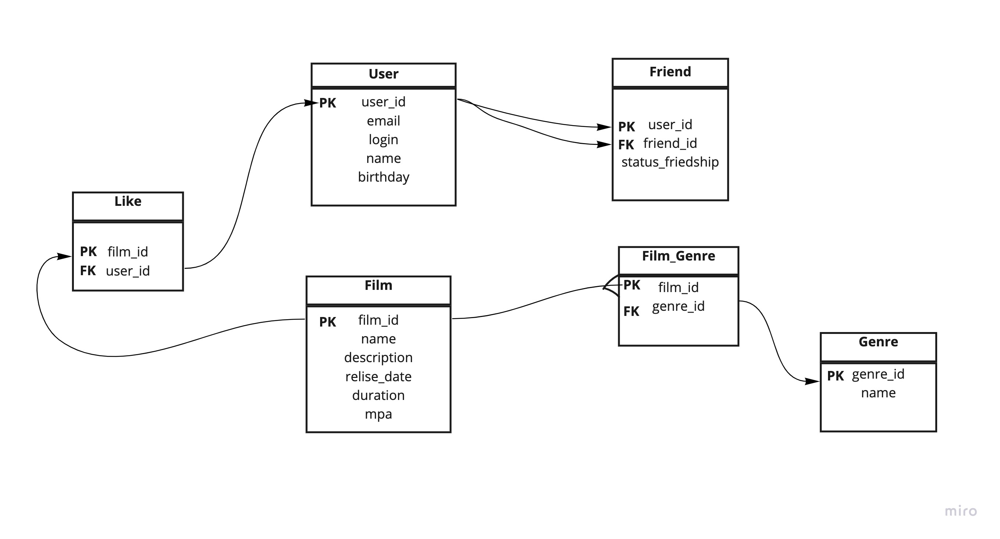

# java-filmorate
Template repository for Filmorate project.

## Database scheme


Запрос на вывод всех фильмов
```
SELECT f.name, 
f.id,
f.description,
f.releaseDate,
f.duration
FROM Film as f
JOIN Genre as g ON g.genre_id = f.genre_id;
```

Запрос на получение фильма по id:
```
SELECT f.name,
f.id,
g.genre
FROM Film
JOIN Genre as g ON g.genre_id = f.genre_id
WHERE film_id=$id;
```
Запрос на получение топ 10 фильмов
```
SELECT f.name,
f.id,
COUNT(l.user_id) as likesCount
FROM Film as f
JOIN Like as l ON l.film_id = f.film_id
GROUP BY f.id
ORDER BY likesCount DESC
LIMIT 10;
```
Запрос на вывод всех пользователей
```
SELECT id,
email,
login,
name,
birthday
FROM User;
```
Вывод друзей пользователя
```
SELECT u.id,
u.email,
u.login,
u.name,
u.birthday
f.user_id
FROM User as u
JOIN Friend as f ON f.user_id = u.user_id
WHERE user_id=$id;
```
Запрос на получение пользователя по id:
```
SELECT id,
email,
login
FROM User 
WHERE user_id=$id;
```
